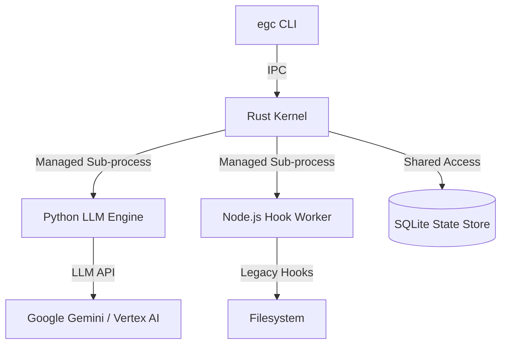

# EGC 2.0 TECHNICAL DESIGN: THE AGENT OS FOUNDATION

**Architect:** EGC Architectural Unit  
**Status:** Technical Specification  
**Version:** 1.0.0 (Design Proposal)

---

## 1. COMPONENT INTEGRATION MAP

The EGC 2.0 architecture centralizes orchestration into a **Rust-based Persistent Kernel**.



---

## 2. UNIFIED CONTROL PLANE (THE KERNEL)

### 2.1 Persistent Orchestration
- The Kernel starts as a background daemon (`egcd`).
- It maintains a pool of workers:
    - **LLM Pool:** Python processes for inference and logic.
    - **Hook Pool:** Node.js processes for governance execution.

### 2.2 IPC Protocol (gRPC/Protobuf)
Replaces the fragile STDIN/STDOUT JSON piping.

**Service Definition:**
```protobuf
service AgentOS {
  rpc ExecutePrompt(PromptRequest) returns (PromptResponse);
  rpc InterceptTool(ToolCall) returns (InterceptionResult);
  rpc LogEvent(Event) returns (Ack);
}
```

---

## 3. DETERMINISTIC MEMORY FABRIC

### 3.1 Unified Storage Schema (SQLite)
The Kernel manages a single SQLite database in `~/.gemini/egc/egc.db`.

**Core Tables:**
- `sessions`: `id (PK), project_id, metadata, start_time, end_time`
- `events`: `id, session_id, event_type, payload (JSON), timestamp`
- `instincts`: `id, project_id, trigger, content (Markdown), confidence`

### 3.2 Namespace Migration
- **Target:** `~/.gemini/egc/`
- **Bridge:** During the transition, if `~/.gemini/egc/` is missing, the Kernel will attempt to symlink or migrate data from `~/.gemini/homunculus/`.

---

## 4. HIGH-FIDELITY GOVERNANCE (STATE-BLOCKING)

### 4.1 The Interceptor Loop
The Kernel implements a synchronous, blocking governance gate for every tool call.

1. **`TOOL_REQUEST`**: Python engine requests tool execution.
2. **`PRE_FLIGHT_CHECK`**: Kernel dispatches blocking hooks to Node.js workers.
3. **`VETO_OR_MUTATE`**: If a hook fails or mutates, the Kernel responds to Python immediately (blocking execution).
4. **`EXECUTION`**: If checks pass, Kernel executes the tool.
5. **`POST_FLIGHT_AUDIT`**: Kernel captures result, dispatches result-aware hooks, then returns final result to Python.

### 4.2 Causal Integrity
By moving the loop into the Kernel, we ensure that `PostToolUse` always has access to the tool's return value *before* the model continues its reasoning.

---

## 5. SOVEREIGNTY & COMPATIBILITY

### 5.1 Artifact Compatibility
- **Agents:** EGC 2.0 reads the same `agents/*.md` files.
- **Skills:** Skill documentation remains authoritative. The Kernel injects them into the Python engine's context.

### 5.2 Environmental Sovereignty
- Eliminates hardcoded references to `ECC_*` in core logic.
- Standardizes on `EGC_PROJECT_ROOT` and `EGC_SESSION_ID`.

---
**Architect's Verdict:** This design solves the "Process Fragmentation" of v1 by introducing a shared circulatory system for state and control, establishing EGC as a true sovereign Agent OS.
